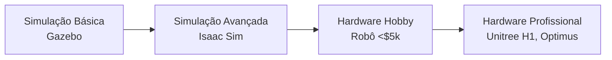

import Tabs from '@theme/Tabs';
import TabItem from '@theme/TabItem';

# 🎮 Introdução à Operação de Humanoides

:::tip Objetivo do Módulo
Você vai aprender o que significa **operar** um robô humanoide na prática, as diferenças entre simulação e hardware real, e como preparar-se para trabalhar com esses sistemas.
:::

---

## 🤔 O Que é "Operar" um Humanoide?

Operar um robô humanoide vai além de simplesmente ligá-lo. Envolve um conjunto de habilidades práticas:

<Tabs>
<TabItem value="controle" label="🎮 Controle Direto">

**Teleoperação e Comando Manual**

- **Interface de controle** (joystick, tablet, realidade virtual)
- **Comandos de movimento** (andar, agachar, pegar objetos)
- **Monitoramento em tempo real** (câmeras, sensores, status do sistema)
- **Intervenção de emergência** (botão de parada, modo manual)

**Exemplo:** Operador da Boston Dynamics controlando Atlas em missão de resgate

</TabItem>
<TabItem value="supervisao" label="👁️ Supervisão Autônoma">

**Monitoramento de Sistemas Autônomos**

- **Definir tarefas de alto nível** ("vá até a área X e inspecione")
- **Supervisionar execução** (acompanhar progresso, verificar desvios)
- **Gerenciar exceções** (robot travou, obstáculo inesperado)
- **Análise de telemetria** (temperatura, bateria, erros)

**Exemplo:** Supervisor na Tesla acompanhando 20 Optimus em linha de produção

</TabItem>
<TabItem value="manutencao" label="🔧 Manutenção Operacional">

**Cuidados Diários e Preventivos**

- **Calibração de sensores** (IMU, encoders, força)
- **Inspeção física** (desgaste mecânico, vazamentos, cabos)
- **Atualização de software** (firmware, parâmetros de controle)
- **Gestão de bateria** (ciclos de carga, balanceamento)

**Exemplo:** Técnico na BMW fazendo calibração matinal dos Figure 02

</TabItem>
</Tabs>

---

## 🎯 Por Que Aprender a Operar Humanoides?

### 💼 Oportunidades de Carreira (2025-2030)

| Cargo | Faixa Salarial (EUA) | Empresas Contratando |
|-------|---------------------|----------------------|
| **Robot Operator** | $45k - $75k/ano | Tesla, BMW, Amazon, Hyundai |
| **Simulation Engineer** | $70k - $110k/ano | NVIDIA, Boston Dynamics, Agility |
| **Fleet Supervisor** | $80k - $130k/ano | Tesla, Figure, Apptronik |
| **Maintenance Technician** | $50k - $85k/ano | Todos os fabricantes OEM |

:::info Mercado em Crescimento
A **International Federation of Robotics (IFR)** prevê **50.000+ postos** de trabalho em operação de humanoides até 2028.
:::

### 🚀 Vantagens de Dominar a Operação

1. **Entrada mais rápida no mercado** (não requer doutorado em robótica)
2. **Experiência prática com hardware real** (diferencial no currículo)
3. **Base para programação avançada** (Tier 3: entender o sistema antes de programá-lo)
4. **Network com empresas pioneiras** (muitas contratam operadores primeiro)

---

## 🌍 Simulação vs. Hardware Real

### Quando Usar Cada Ambiente?

<Tabs>
<TabItem value="simulacao" label="💻 Simulação (Gazebo, Isaac Sim)">

**✅ Vantagens:**
- **Segurança total** (sem risco de danos ao hardware)
- **Custo zero** (não precisa comprar robô de $90k)
- **Iteração rápida** (testar 1000 cenários em 1 hora)
- **Controle total do ambiente** (gravidade, fricção, objetos)

**❌ Limitações:**
- **Sim-to-Real Gap** (comportamento difere do real)
  - Fricção simulada ≠ fricção real
  - Deformação de materiais não capturada
  - Atrasos de comunicação não modelados
- **Sensores idealizados** (sem ruído realista)
- **Física aproximada** (colisões, contatos)

**📌 Use para:**
- Aprender conceitos básicos de operação
- Testar algoritmos de controle
- Treinar IA (reinforcement learning)
- Validar segurança antes de hardware real

</TabItem>
<TabItem value="hardware" label="🤖 Hardware Real">

**✅ Vantagens:**
- **Realismo 100%** (todos os efeitos físicos reais)
- **Validação definitiva** (o que funciona aqui, funciona em produção)
- **Experiência com desafios reais** (vibrações, atrasos, falhas)
- **Credibilidade profissional** (experiência prática valorizada)

**❌ Desafios:**
- **Custo altíssimo** ($20k - $150k+ por unidade)
- **Risco de danos** (queda pode custar $10k+ em reparos)
- **Iteração lenta** (testar 1 cenário pode levar 1 hora)
- **Infraestrutura necessária** (espaço, segurança, manutenção)

**📌 Use para:**
- Validação final de algoritmos
- Treinamento de operadores profissionais
- Coleta de dados reais para IA
- Demonstrações comerciais

</TabItem>
</Tabs>

### 🎓 Estratégia de Aprendizado Progressivo

**Recomendação:**
1. **Meses 1-3:** Simulação (Gazebo + ROS2) - Grátis
2. **Meses 4-6:** Simulação avançada (Isaac Sim) - Grátis
3. **Meses 7-9:** Hardware hobby (kit DIY $2k-5k) - Opcional
4. **Meses 10+:** Estágio/emprego com acesso a hardware profissional

---

## 📋 Pré-Requisitos para Este Tier

### ✅ O Que Você Já Precisa Saber

| Tópico | Nível Necessário | Onde Revisar |
|--------|------------------|--------------|
| **Fundamentos de Humanoides** | Completo | [Tier 1: Módulos 1-10](../tier1/introducao) |
| **Linux básico** | Comandos essenciais (`cd`, `ls`, `sudo`) | Terminal Linux |
| **Python básico** | Sintaxe, loops, funções | Curso Python gratuito |
| **Conceitos de redes** | IP, SSH, firewall | Tutoriais básicos |

:::warning Importante
Se você **não completou o Tier 1**, recomendamos fortemente revisar pelo menos os módulos:
- [Módulo 4: Sensores](../tier1/sensores)
- [Módulo 5: Atuadores](../tier1/atuadores)
- [Módulo 8: Software e IA](../tier1/software)
:::

### 💻 Equipamento Recomendado

<Tabs>
<TabItem value="minimo" label="⚡ Mínimo (Simulação Leve)">

**Especificações:**
- **CPU:** Intel i5 / AMD Ryzen 5 (4 cores)
- **RAM:** 8 GB
- **GPU:** Integrada (Intel UHD / AMD Vega)
- **SO:** Ubuntu 22.04 LTS (nativo ou WSL2)

**O que roda:**
- ✅ Gazebo Classic (modelos simples)
- ✅ RViz (visualização 3D)
- ✅ ROS2 Humble
- ❌ Isaac Sim (muito pesado)

</TabItem>
<TabItem value="recomendado" label="🚀 Recomendado (Simulação Completa)">

**Especificações:**
- **CPU:** Intel i7 / AMD Ryzen 7 (8 cores)
- **RAM:** 16 GB
- **GPU:** NVIDIA GTX 1660 / RTX 3060 (6+ GB VRAM)
- **Armazenamento:** 512 GB SSD
- **SO:** Ubuntu 22.04 LTS (dual boot)

**O que roda:**
- ✅ Gazebo Fortress (física avançada)
- ✅ Isaac Sim (ray tracing realista)
- ✅ ROS2 Humble + MoveIt
- ✅ Machine learning (PyTorch)

</TabItem>
<TabItem value="profissional" label="💎 Profissional (Hardware Real)">

**Especificações:**
- **Workstation:** Dell Precision / HP Z Series
- **CPU:** Intel i9 / AMD Threadripper (16+ cores)
- **RAM:** 64 GB
- **GPU:** NVIDIA RTX 4080 / A6000 (16+ GB VRAM)
- **Armazenamento:** 2 TB NVMe SSD
- **SO:** Ubuntu 22.04 LTS (dual boot)

**Extras:**
- **Joystick profissional** (SpaceMouse, Xbox Elite)
- **Rede dedicada** (Switch Gigabit, router isolado)
- **UPS** (proteção contra quedas de energia)

**Uso:**
- ✅ Fleet de robôs (controlar múltiplos humanoides)
- ✅ Simulação em paralelo (10+ cenários simultâneos)
- ✅ Treinamento de IA (reinforcement learning pesado)

</TabItem>
</Tabs>

---

## 🗺️ Estrutura do Tier 2

### 📚 10 Módulos Progressivos

| # | Módulo | Tempo | Foco |
|---|--------|-------|------|
| **1** | 🎮 **Introdução à Operação** | 12 min | Conceitos, carreira, pré-requisitos |
| **2** | 🛡️ **Segurança Operacional** | 18 min | E-stop, zonas de risco, procedimentos |
| **3** | 🕹️ **Interfaces de Controle** | 20 min | Joystick, VR, tablet, comandos de voz |
| **4** | 📊 **Telemetria e Monitoramento** | 22 min | Dashboards, logs, alertas, diagnóstico |
| **5** | ⚙️ **Calibração de Sistemas** | 20 min | IMU, encoders, sensores de força, câmeras |
| **6** | 🔧 **Manutenção Preventiva** | 18 min | Inspeção, lubrificação, trocas, checklist |
| **7** | 🌐 **Introdução a Simuladores** | 16 min | Comparação, escolha, setup inicial |
| **8** | 🏗️ **Gazebo Fortress** | 24 min | Instalação, modelos, física, plugins |
| **9** | 🎥 **NVIDIA Isaac Sim** | 26 min | Ray tracing, IA, robôs reais, domínio |
| **10** | 🚀 **Operação Prática Completa** | 20 min | Projeto final: missão end-to-end |

**Total:** ~3.5 horas de conteúdo prático

---

## 🎯 O Que Você Vai Conseguir Fazer ao Final

Ao completar o **Tier 2**, você será capaz de:

### ✅ Habilidades Técnicas

1. **Operar um humanoide simulado** (Gazebo ou Isaac Sim)
   - Teleoperação com joystick/teclado
   - Comandar movimentos complexos (andar, agachar, manipular)
   - Monitorar telemetria em tempo real

2. **Supervisionar sistemas autônomos**
   - Definir tarefas de alto nível
   - Detectar e resolver exceções
   - Analisar logs e métricas de desempenho

3. **Realizar manutenção operacional**
   - Calibrar sensores (IMU, força, câmeras)
   - Diagnosticar problemas comuns
   - Aplicar procedimentos de segurança

4. **Simular cenários realistas**
   - Criar ambientes 3D (fábrica, armazém, escritório)
   - Modelar física realista (fricção, gravidade, colisões)
   - Integrar sensores virtuais (LIDAR, câmeras depth)

### 💼 Pronto Para o Mercado

| Cargo | Você Estará Qualificado? |
|-------|--------------------------|
| **Robot Operator (Júnior)** | ✅ Sim (com portfólio de simulação) |
| **Simulation Technician** | ✅ Sim (Gazebo + Isaac Sim) |
| **Maintenance Assistant** | 🟡 Parcialmente (precisa estágio) |
| **Fleet Supervisor** | ❌ Não (precisa Tier 3 + experiência) |

---

## 🔗 Próximos Passos

:::tip Pronto para Começar?
Vá para o próximo módulo: **[Segurança Operacional](./seguranca)**

Você vai aprender os protocolos de segurança essenciais para trabalhar com humanoides sem acidentes.
:::

### 📖 Recursos Extras

- **[Documentação ROS2 Humble](https://docs.ros.org/en/humble/)** - Referência oficial
- **[Gazebo Tutorials](https://gazebosim.org/docs)** - Guias passo a passo
- **[NVIDIA Isaac Sim](https://developer.nvidia.com/isaac-sim)** - Download e docs
- **[r/ROS Community](https://reddit.com/r/ROS)** - Fórum de dúvidas

---

## ❓ FAQ - Dúvidas Comuns

### 1. Preciso comprar um robô para aprender?

**Não!** Todo o Tier 2 pode ser completado usando **apenas simuladores gratuitos** (Gazebo, Isaac Sim). Você só precisaria de hardware real se quiser:
- Trabalhar profissionalmente como operador
- Fazer pesquisa acadêmica com dados reais
- Montar um portfólio com vídeos de robôs físicos

### 2. Quanto tempo leva para completar o Tier 2?

**Estimativa:** 4-8 semanas (dedicando 5-10 horas/semana)
- **Ritmo acelerado:** 4 semanas (10h/semana)
- **Ritmo moderado:** 6 semanas (7h/semana)
- **Ritmo relaxado:** 8 semanas (5h/semana)

### 3. Posso pular direto para o Tier 3 (Programação)?

**Não recomendamos.** O Tier 2 te dá:
- **Intuição sobre o hardware** (entender limitações físicas)
- **Experiência com ferramentas** (RViz, Gazebo, logs)
- **Segurança operacional** (evitar danos ao programar)

Programadores que **pulam** a operação frequentemente escrevem código que:
- ❌ Quebra o hardware (comandos acima dos limites)
- ❌ Ignora segurança (sem validação de sensores)
- ❌ Não funciona no mundo real (não testa em simulação primeiro)

### 4. Qual simulador devo usar: Gazebo ou Isaac Sim?

**Use AMBOS!**

| Aspecto | Gazebo Fortress | Isaac Sim |
|---------|----------------|-----------|
| **Melhor para** | Aprender ROS2, testes rápidos | IA, ray tracing, realismo |
| **Curva de aprendizado** | Moderada | Íngreme |
| **Requisitos de hardware** | Baixos (GPU integrada ok) | Altos (NVIDIA RTX obrigatório) |
| **Comunidade** | Enorme (10+ anos) | Crescendo rápido |

**Recomendação:** Comece com Gazebo (Módulo 8), depois migre para Isaac Sim (Módulo 9).

---

## 🎬 Próximo Módulo

**[🛡️ Segurança Operacional →](./seguranca)**

Aprenda os protocolos de segurança essenciais para trabalhar com robôs humanoides sem acidentes.
